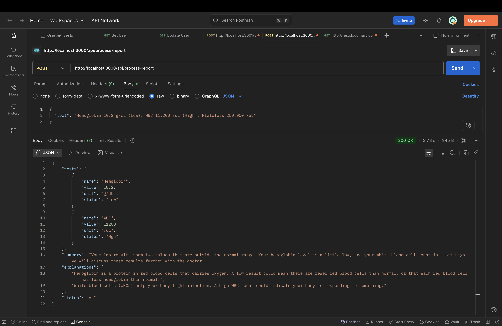
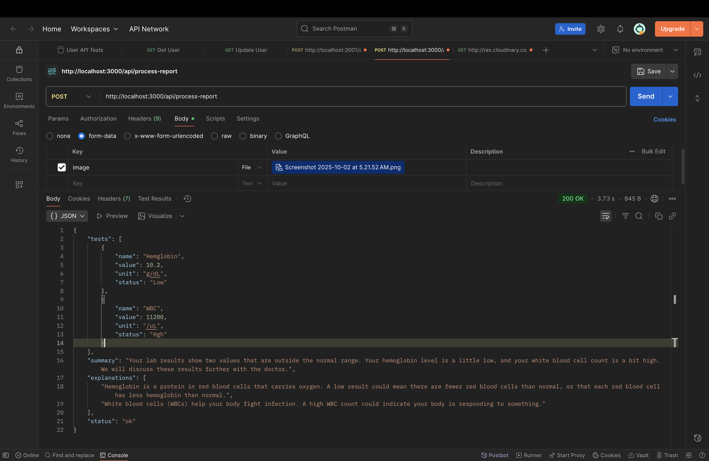

# AI-Powered Medical Report Simplifier

This is a backend service that takes medical reports (either as raw text or scanned images) and uses a chain of AI prompts to produce patient-friendly explanations. It extracts, normalizes, and validates test results before generating a simple summary, ensuring no medical advice or hallucinated data is provided.

---

## 🏛️ Architecture Overview

The application follows a standard Node.js service architecture:

* **Express API Layer**: A single `POST /api/process-report` endpoint handles all incoming requests, supporting both JSON (`text`) and multipart/form-data (`image`) inputs.
* **Controller**: Manages the request flow and orchestrates the services.
* **Service Layer**:
    * `ocr.service.js`: Uses Tesseract.js to perform Optical Character Recognition on image inputs.
    * `ai.service.js`: Interacts with the Google Gemini API. It contains separate, purpose-built prompts for **normalizing** data and **summarizing** results.
    * `validation.service.js`: Acts as a crucial **guardrail**, ensuring the AI does not "hallucinate" tests that were not present in the original input text.
* **MongoDB Data Layer**: Mongoose is used to model and save the final processed reports (both successful and unprocessed) for auditing and record-keeping.

---

## ✨ Features

* **Dual Input**: Accepts both raw text and image uploads.
* **OCR**: Automatically extracts text from medical report images.
* **AI Normalization**: Converts unstructured text into a clean, consistent JSON format.
* **AI Summarization**: Explains abnormal results in simple, non-diagnostic terms.
* **Hallucination Guardrail**: Validates AI output against the source text to ensure data integrity.
* **Database Persistence**: Logs every request and its outcome in MongoDB.

---

## 🛠️ Technology Stack

* **Backend**: Node.js, Express.js
* **Database**: MongoDB with Mongoose
* **OCR**: Tesseract.js
* **AI**: Google Gemini Flash API
* **File Handling**: Multer
* **Environment**: dotenv

---

## 🚀 Getting Started

Follow these instructions to get a local copy up and running.

### Prerequisites

* Node.js (v18 or later)
* npm
* A MongoDB database instance (local or via Atlas)
* A Google Gemini API Key

### Installation & Setup

1.  **Clone the repository:**
    ```bash
    git clone [https://github.com/dhruv4115/medical-report-simplifier.git](https://github.com/dhruv4115/medical-report-simplifier.git)
    cd medical-report-simplifier
    ```

2.  **Install NPM packages:**
    ```bash
    npm install
    ```

3.  **Set up environment variables:**
    Create a `.env` file in the root of the project and add the following variables.
    ```
    # Your MongoDB connection string
    MONGO_URI=mongodb+srv://...

    # Your Google Gemini API Key
    GEMINI_API_KEY=AIzaSy...

    # The port to run the server on
    PORT=3000
    ```

4.  **Run the server:**
    ```bash
    npm run dev
    ```
    The server will start on `http://localhost:3000`.

---

## ⚙️ API Usage

The API has a single endpoint for processing reports.

### Endpoint

`POST /api/process-report`

### Success Response (`200 OK`)

```json
{
    "tests": [
        {
            "name": "Hemoglobin",
            "value": 10.2,
            "unit": "g/dL",
            "status": "Low"
        },
        {
            "name": "WBC",
            "value": 11200,
            "unit": "/uL",
            "status": "High"
        }
    ],
    "summary": "The report shows a low hemoglobin level and a high white blood cell count.",
    "explanations": [
        "Low hemoglobin may be related to conditions like anemia.",
        "High white blood cell counts can sometimes occur with infections."
    ],
    "status": "ok"
}
```

### Error Response - Hallucination Detected (`400 Bad Request`)

```json
{
    "status": "unprocessed",
    "reason": "hallucinated tests not present in input"
}
```

---

## 📸 Screenshots

### Text Input Demo



### Image Input Demo



---

## 🤖 Prompts Used

### 1. Normalization Prompt

> You are an expert medical data extraction bot. Your task is to analyze the following medical report text and convert it into a structured JSON object.
>
> Follow these rules strictly:
> 1. Extract all medical tests mentioned.
> 2. For each test, identify the "name", "value" (as a number), "unit", and "status" (e.g., "Low", "High", or "Normal" if indicated).
> 3. If reference ranges are provided, include them in a "ref_range" object with "low" and "high" keys.
> 4. Your response MUST BE ONLY the JSON object, with no extra text, explanations, or markdown formatting.
> 5. Do NOT invent or hallucinate any tests or values not present in the text.
>
> The final JSON must follow this exact schema:
> {
>   "tests": [
>     {
>       "name": "string",
>       "value": number,
>       "unit": "string",
>       "status": "string",
>       "ref_range": { "low": number, "high": number }
>     }
>   ],
>   "normalization_confidence": number (a value between 0 and 1)
> }

### 2. Summarization Prompt

> You are a helpful medical assistant who explains lab results in simple, non-alarming terms.
> Based on the following abnormal lab results, generate a patient-friendly summary and a list of brief, general explanations for each finding.
>
> Follow these rules strictly:
> 1. **DO NOT provide a diagnosis, medical advice, or treatment recommendations.** This is critical.
> 2. Keep the language simple and easy for a non-medical person to understand.
> 3. Your response must be ONLY a JSON object with two keys: "summary" (a single string) and "explanations" (an array of strings).